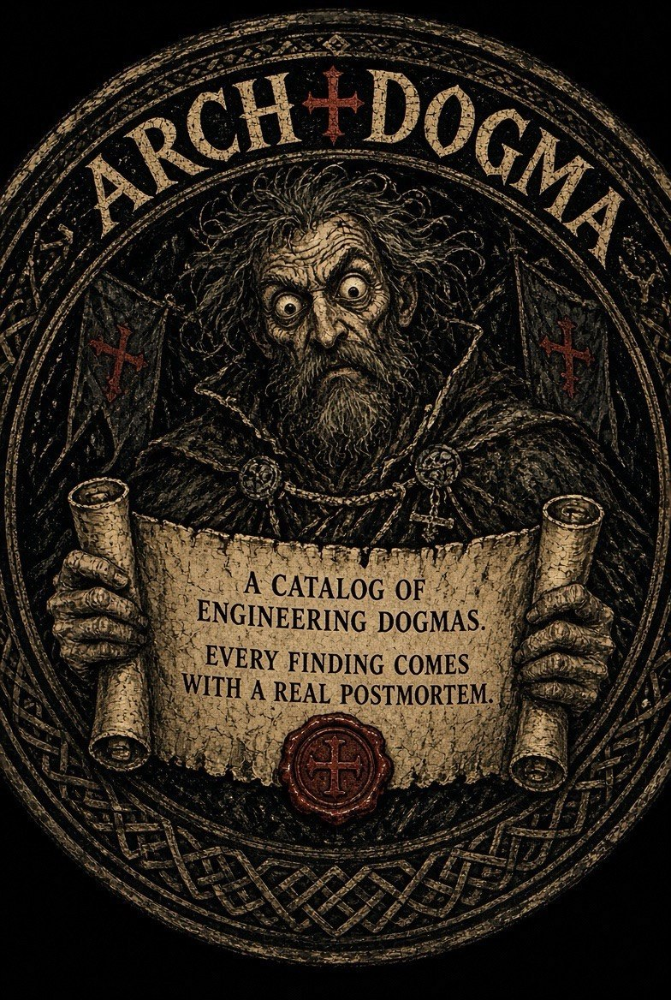

# ArchDogma

<div align="center">
  
</div>

> **A catalog of real engineering failures. The scanner is just a way to find them in your code.**

---

## The Catalog

Programming has sacred rules. "Always test." "Use microservices." "No copy-paste." "Clean Architecture." Nobody tells you **when these rules start strangling your system**.

ArchDogma collects real postmortems — companies that followed a rule and paid for it. Not to say the rules are wrong. To say they have conditions.

**Current catalog:** 12 dogmas — 7 filled, all with sourced failure cases — and 22 candidates.

Browse the full catalog: [DOGMAS.md](DOGMAS.md)

Or from the CLI:

```bash
pip install archdogma

# View all dogmas with their status and linked cases
archdogma dogmas

# Search for a specific pattern
archdogma search "microservices"
archdogma search "inheritance"
archdogma search "coverage"

# Get the whole argument for one entry — rule, origin, cases, when to break it
archdogma explain dry
archdogma explain circular-import   # by detector tag
archdogma explain 4                 # by number
archdogma explain dry --speak       # spoken summary, same as probe --speak
```

### Selected postmortems

**Microservices for everything → Segment (2022)**
140+ services, one per data destination. Routing logic duplicated 140 times. On-call couldn't hold the system in their head. Rewrote as one Go service. Delivery reliability improved.
→ [full case](DOGMAS.md#4-microservices-for-everything-)

**DRY → shared config with 14 flags (QuackNet, 2025)**
ProbeConfig abstracted after 2 similar structs. Grew to 14 flags as 4 subsystems diverged. A Kafka change broke the Wi-Fi probe. Split back into 3 structs. The abstraction cost more than the duplication would have.
→ [full case](DOGMAS.md#3-dry-dont-repeat-yourself-)

**TDD → over-mocked suite that passed but missed integration bugs (Basecamp, 2014)**
Tests mocked every boundary for unit purity. Integration bugs multiplied. DHH: "Test-driven development as ideology led to designing for tests instead of designing for the problem."
→ [full case](DOGMAS.md#6-tdd-test-driven-development-)

**OOP inheritance → 7 files for a 5-line business rule (Java EJB era, 2002)**
EJB 2.x required Home + Local + Remote interfaces + XML for every entity. Rod Johnson documented it and built Spring to eliminate the inheritance tax.
→ [full case](DOGMAS.md#5-oop-as-the-only-truth-inheritance-everywhere-)

---

## The Scanner

Once you know which dogmas are in play, find them in your code:

```bash
# Probe one function — Trust Score, AST tags, linked dogmas
archdogma probe mymodule.py -f MyClass.process

# Scan functions and classes — CI-ready
archdogma scan src/
archdogma scan src/ --fail   # exit 1 if any tag fires

# Analyse module structure and change history
archdogma modules src/
archdogma modules src/ --all --no-history
```

**The scanner is secondary.** The catalog is the point. If the catalog didn't have real postmortems, the scanner would just be another linter. The postmortems are what make a detected pattern meaningful: "here's who followed this rule and where it broke them."

### Three tiers, three kinds of question

**Tier 1 — one function or class.** `deep-nesting`, `long-function`, `god-function`, `too-many-params`, `if-on-parameter`, `magic-numbers`, `dynamic-magic`, `broad-except`, `mutable-default-arg`, `too-many-returns`, `god-class`, `deep-inheritance`.

**Tier 2 — the import graph.** `circular-import`, `hub-module`, `god-module`, `unstable-dependency`. Questions that do not exist inside a single file: what does everything depend on, and do the dependencies point where the folder names claim they do.

**Tier 3 — structure crossed with `git log`.** `load-bearing-wall`, `churn-hotspot`, `single-author-hub`, `temporal-coupling`. Tier 2 knows that forty modules import `core.py`; Tier 3 knows nobody has changed it in three years. Neither fact is alarming alone. And `temporal-coupling` finds the pairs that keep changing together while neither imports the other — the relationship no graph can show you.

Tier 3 needs a git work tree. Outside one — a shallow clone, a tarball, no git — every Tier 3 detector goes silent and says so. A missing history is not evidence of a young file.

### For agents and CI

`--format json` is the machine-readable surface, and it carries the catalog with it:

```bash
archdogma modules src/ --format json
```

Every tag reports the ids of the catalog entries that claim it. Those entries are emitted once at the top level with `break_when`, `main_signal`, and links to the postmortems:

```json
{
  "tags": [{"name": "circular-import", "dogmas": ["clean-architecture"]}],
  "catalog": {
    "entries": {
      "clean-architecture": {
        "break_when": ["Team smaller than 5 and single product — ..."],
        "main_signal": "You spend more time writing mappers between layers ..."
      }
    }
  }
}
```

That is the difference between a linter and this: `god-module at line 1` is no more useful than `C0301 line too long`. A tag with the conditions under which its dogma stops working is something you can argue with.

---

## Install

```bash
pip install archdogma
```

Or from source:

```bash
git clone https://github.com/gaidar0yegor/ArchDogma
cd ArchDogma
pip install -e .
```

---

## Why This Exists

90% of engineering is understanding old code. And that code is full of dogmas applied without context. "Always test" — gamified into 100% coverage with no assertions. "Microservices" — applied to a 3-person team building one product. "Clean Architecture" — 5 layers for a CRUD app.

The pattern is predictable: a good rule gets applied without its conditions. Nobody wrote down when it stops working. The postmortems exist to fix that.

---

## Honesty rules

- Every postmortem has a source link, or is explicitly marked first-party / `source_url: null`.
- Every claim can be challenged via the `honesty-bug` label on GitHub.
- The scanner produces verifiable AST signals. No "expert" numbers without evidence.
- If a detector doesn't exist yet, the catalog says so: `[NEED POSTMORTEMS]`.

---

## Accessibility

Voice mode from day one:

```bash
archdogma probe mymodule.py -f my_function --speak
```

Sighted and blind engineers get the same information. Not "later" — from the start.

---

## Contributing

**What we need most:** real postmortems. Which dogma was applied at your company, under what conditions, and what broke.

- **Post-mortem sources** — open an issue with `postmortem` label
- **Blind/low-vision engineers** — primary reviewers of voice mode
- **Honesty bugs** — if you see a claim without a source, open `honesty-bug`

Source of truth for the catalog: `catalog/dogmas.yaml`. `DOGMAS.md` is auto-generated via `archdogma render-catalog`.

---

## License

MIT. Fork it, improve it.

If your fork drops the honesty rules or voice mode — don't call it ArchDogma.

🦫
